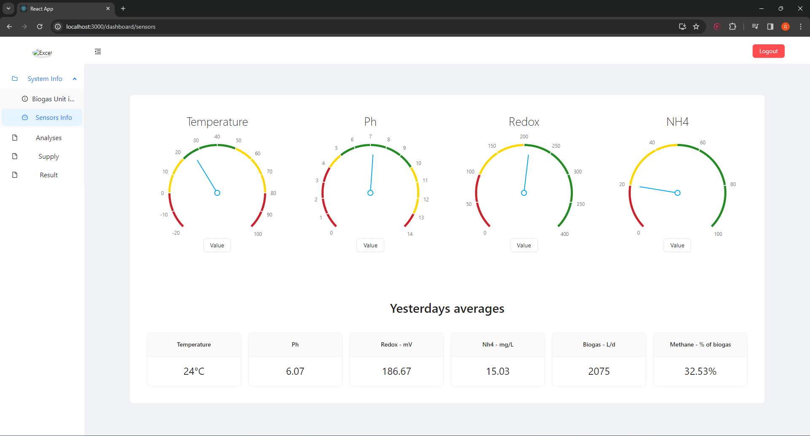
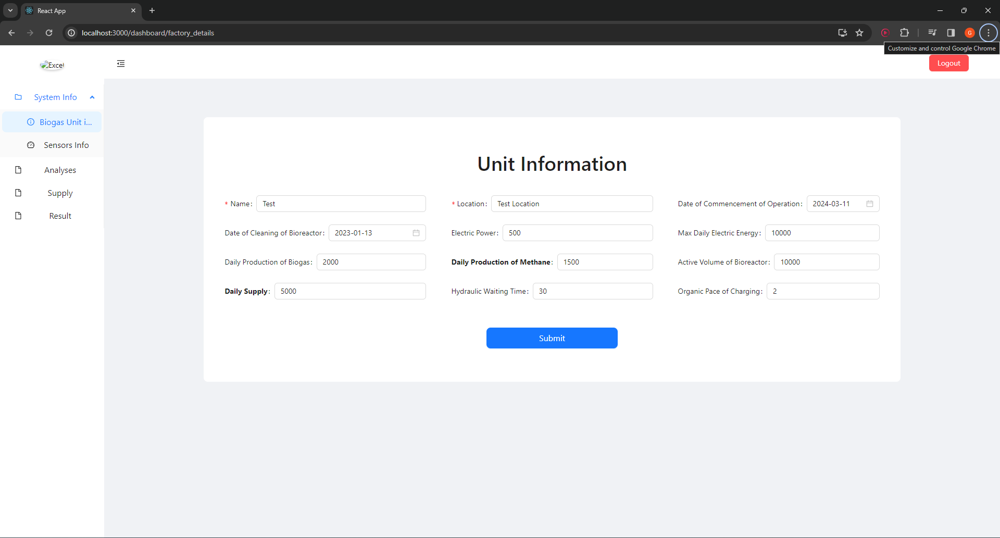

# Stefanos Ifoulis — Full-Stack Software Engineer

**Java · Spring Boot · React · TypeScript · Microservices** — Thessaloniki, Greece · EU citizen · Remote-ready

I design and ship complete enterprise systems end to end — from requirements to Linux production deployments.

📄 **[Resume (PDF)](Stefanos%20Ifoulis%20-%20Resume.pdf)** · 📫 [Ifoulis.Stefanos@gmail.com](mailto:Ifoulis.Stefanos@gmail.com) · 💼 [LinkedIn](www.linkedin.com/in/stefanos-ifoulis-3986b320a)

---

## 🚗 Car Rental CRM/ERP Platform — Founder & sole engineer (2024–present)

A multi-service CRM/ERP platform and public booking site for car-rental companies, **in production with pilot client 4Rent S.A.** — bookings, customers, vehicles, availability, payments and reporting.

- **12 Spring Boot services** — 10 domain microservices behind an API gateway with Eureka service discovery
- React/TypeScript frontends, MySQL + MongoDB persistence, Keycloak authentication
- RabbitMQ event-driven messaging; Redis for caching, rate limiting and distributed locks
- Stripe Checkout with webhook-driven payment confirmation and 30-minute booking holds on the multilingual (EN/EL/DE/IT) public site
- Prometheus / Grafana / Loki / Tempo observability stack (metrics, logs, traces)
- Cut a core booking query from **7.9 s to 0.25 s (~30× faster)** with DTO projections and server-side pagination

📑 [Full technical document (PDF)](Car%20Rental%20CRM/Car_Rental_CRM_Technical_Document.pdf) · 🖼 [All screenshots](Car%20Rental%20CRM/ScreenShots)

  
  

---

## 🌱 SmartCH4 — Industrial biogas monitoring & methane prediction (Biogas Lagadas S.A., 2024)

Enterprise information system for the EU co-funded **Smart Methane** project (Greece's NSRF program), built to specifications from the Aristotle University of Thessaloniki School of Agriculture. Live sensor monitoring, lab analyses, feed planning and methane-production prediction for an industrial biogas plant.

- Spring Boot REST backend, React/TypeScript frontend (Ant Design), MySQL, Keycloak SSO
- Sensor dashboards (temperature, pH, redox, NH₄) with daily aggregates
- Decision-service integration for feed optimization and methane prediction
- Dockerized, deployed on a Linux server

📑 [Technical case study (PDF)](Smart_Ch4/SmartCH4_Friendly_Technical_Case_Study.pdf) · 🖼 [All screenshots](Smart_Ch4/Screenshots)

  
  

---

## 📊 Agricultural Excel Creator (Ergoplanning S.A., 2023)

Full-stack automation of agricultural work calendars under the **Agro 2-1 / 2-2** integrated-management standards. Transforms farmer data and agronomic rules into a complete ten-sheet Excel calendar — **cutting preparation time from 8 hours to 20 minutes**.

- Spring Boot, React/TypeScript, MongoDB, Apache POI, Docker
- OSDE XML data import; crop, fertilizer and plant-protection modules
- Generates the finished agricultural calendar as a structured Excel workbook

📑 [Technical documentation (PDF)](Excel%20Creator/Agricultural_Excel_Creator_Technical_Documentation.pdf) · 📗 [Sample generated workbook](Excel%20Creator/Excel%20Outcome/JOHN%20DOE.xlsx) · 🖼 [All screenshots](Excel%20Creator/App%20Screenshots)

  

---

## 🎓 B.Sc. Thesis — MySQL vs MongoDB in a microservices tourism system

The full experimental platform is public at **[stefanif2002/Thesis_Public](https://github.com/stefanif2002/Thesis_Public)**: every microservice built twice (MySQL and MongoDB variants behind identical APIs), benchmarked with a **42-experiment k6 matrix plus YCSB (1M records, 64 threads)** under equal resource caps, reported as mean ± 95% CI.

Highlight: a single compound index took MySQL's transactional write path from **10.8 to 932 req/s**, while sargable equality lookups sped up **up to 650×** — the full results and methodology are in the repo.
